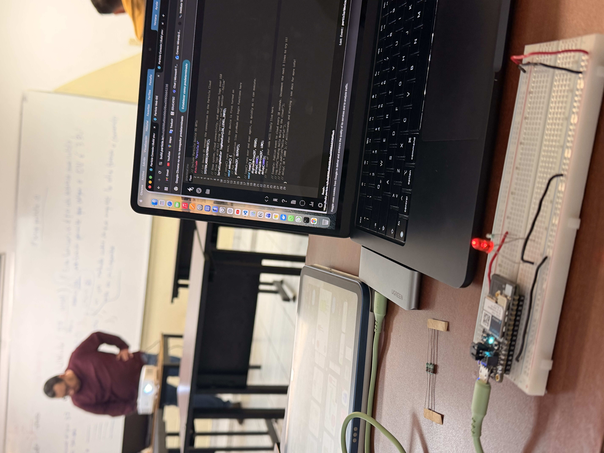
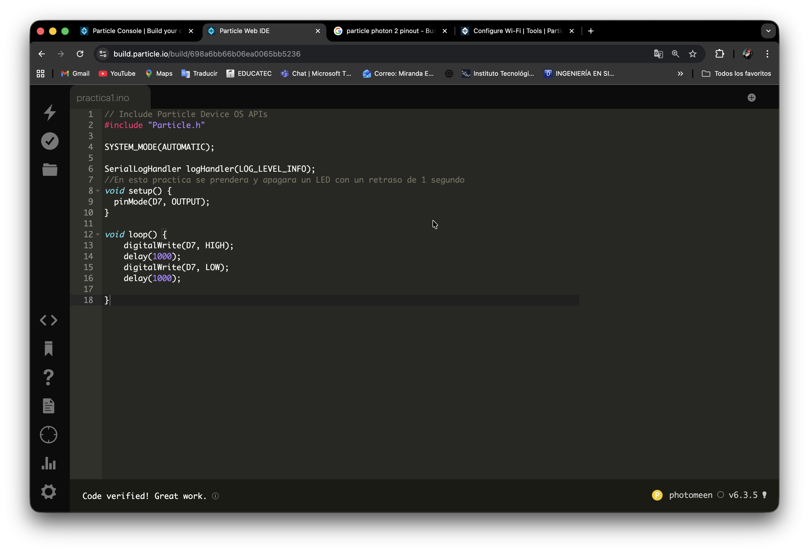

# Práctica 1 - Encender un LED

**Nivel:** Fácil  
**Duración:** 10 minutos

## Objetivo
Encender y apagar un LED conectado al Particle Photon 2 utilizando el Web IDE.

## Material
- 1 × Particle Photon 2
- 1 x Proto Board
- 1 × LED (cualquier color)
- 1 × Resistencia 220Ω
- Cables jumper
- Conexión a Internet

## Conexión

**LED → Pin D7**

| Componente     | Pin Photon2   |
|----------------|---------------|
| LED (ánodo)    | D7            |
| LED (cátodo)   | GND           |
| Resistencia    | Entre LED y D7|

## Ver Simulación

  <h3 style="color: #00f7ff; margin-bottom: 15px;">🔬 Simulación Interactiva – Particle Photon 2</h3>
  
  

    

    <!-- CÍRCULO DEL LED QUE PARPADEA -->
    

    

  

  

    <button onclick="toggleLedSimulation()" 
            id="btnSim"
            style="padding: 14px 40px; font-size: 18px; font-weight: bold; background: #00f7ff; color: #0f172a; border: none; border-radius: 50px; cursor: pointer; box-shadow: 0 0 20px #00f7ff;">
      ▶️ Iniciar Simulación
    </button>
  

  

    Presiona el botón para ver el LED parpadeando cada 1 segundo
  

## Código

**include "Particle.h"**

**SYSTEM_MODE(AUTOMATIC);**

**SerialLogHandler logHandler(LOG_LEVEL_INFO);**

# void setup() {
    pinMode(D7, OUTPUT);
}

# void loop() {
    digitalWrite(D7, HIGH); //Enciende
    delay(1000); //Retraso 1 segundo
    digitalWrite(D7, LOW); //Apaga
    delay(1000);
}

## Procedimiento
1. Colocar el Particle Photon 2 a un extremo del protoboard
2. Colocar el LED en cualqueira de las lineas de conexión que estén libres
3. Conectar el catodo del led a la linea de tierra del protoboard. NOTA: puede ser directo o con un jumper
4. Colocar una resistencia de 220Ω frente al otro extremo del LED (ánodo) NOTA: no importa la direccion de la resistencia, asegurate de que la resistencia este en la lina que tiene continuidad con el LED
5. Conectar el extremo de la resistencia que quedo libre un cable JUMPER para llevarlo al pin elegido (D7)
6. Conectar con un cable de tipo MICRO-USB el Particle Photon 2 a tu PC 
7. Conectar el Particle Photon 2 a Internet, puedes usar este enlace: (https://docs.particle.io/tools/developer-tools/configure-wi-fi/)

## Resultado Esperado
El LED comenzará a encender y apagarse con un retraso de 1 segundo

## Evidencia

## Ver Video
<video width="50%" controls>
  <source src="/manual-iot/assets/videos/practica1.mp4" type="video/mp4">
  Tu navegador no soporta video.
</video>
