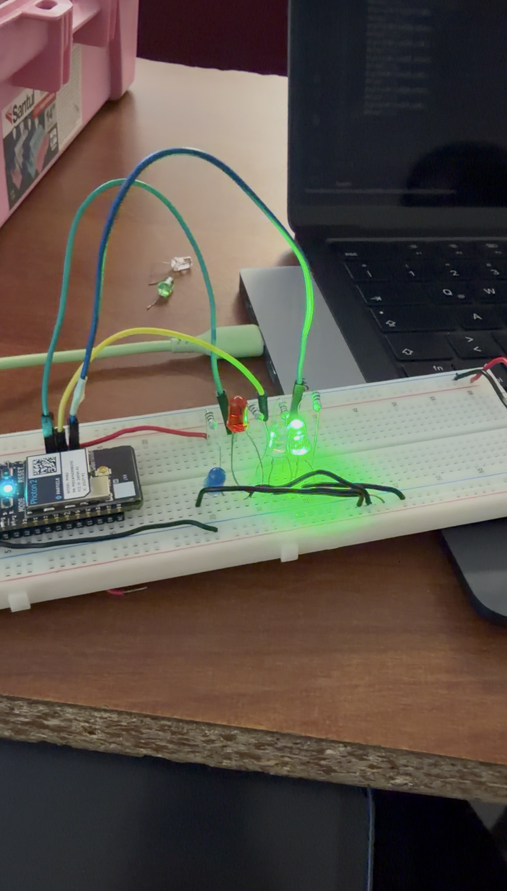
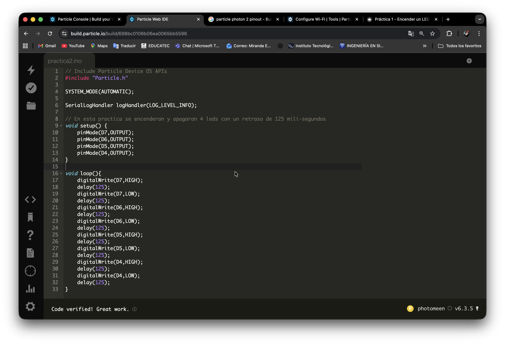

# Práctica 2 - Encender y aapagar 4 LED's

**Nivel:** Fácil  
**Duración:** 12 minutos

## Objetivo
Programar el Photon 2 y prender y apagar 4 leds utilizando el Web IDE.

## Material
- 1 × Particle Photon 2
- 1 x Proto Board
- 4 × LED (cualquier color)
- 4 × Resistencia 220Ω
- Cables jumper
- Conexión a Internet

## Conexión

**LED → Pin D7**

**LED → Pin D2**

**LED → Pin D3**

**LED → Pin D4**

| Componente     | Pin Photon2   |
|----------------|---------------|
| LED (ánodo)    | D7            |
| LED (cátodo)   | GND           |
| Resistencia    | Entre LED y D7|
| LED (ánodo)    | D2            |
| LED (cátodo)   | GND           |
| Resistencia    | Entre LED y D2|
| LED (ánodo)    | D3            |
| LED (cátodo)   | GND           |
| Resistencia    | Entre LED y D3|
| LED (ánodo)    | D4            |
| LED (cátodo)   | GND           |
| Resistencia    | Entre LED y D4|

## Ver Simulación

  <h3 style="color: #00f7ff; margin-bottom: 15px;">🔬 Simulación Interactiva – Particle Photon 2</h3>
  
  

    

    <!-- LED 1 (D7) -->
    

    
    <!-- LED 2 (D2) -->
    

    
    <!-- LED 3 (D3) -->
    

    
    <!-- LED 4 (D4) -->
    

  

  

    <button onclick="toggleSimulation()" 
            id="btnSim"
            style="padding: 14px 40px; font-size: 18px; font-weight: bold; background: #00f7ff; color: #0f172a; border: none; border-radius: 50px; cursor: pointer; box-shadow: 0 0 20px #00f7ff;">
      ▶️ Iniciar Simulación
    </button>
  

  

    LED1 → LED2 → LED3 → LED4 (125 ms cada cambio)
  

## Código

**include "Particle.h"**

**SYSTEM_MODE(AUTOMATIC);**

**SerialLogHandler logHandler(LOG_LEVEL_INFO);**

# void setup() {
    pinMode(D7,OUTPUT);
    pinMode(D2,OUTPUT);
    pinMode(D3,OUTPUT);
    pinMode(D4,OUTPUT);
}

# void loop() {
    digitalWrite(D7,HIGH); //Enciende
    delay(125);    //Retraso
    digitalWrite(D7,LOW);   //Apaga
    delay(125);
    digitalWrite(D2,HIGH);
    delay(125);
    digitalWrite(D2,LOW);
    delay(125);
    digitalWrite(D3,HIGH);
    delay(125);
    digitalWrite(D3,LOW);
    delay(125);
    digitalWrite(D4,HIGH);
    delay(125);
    digitalWrite(D4,LOW);
    delay(125);
}

## Procedimiento
1. Colocar el Particle Photon 2 a un extremo del protoboard
2. Colocar los 4 LED's en cualqueira de las lineas de conexión que estén libres
3. Conectar el catodo de los 4 led's a la linea de tierra del protoboard. NOTA: puede ser directo o con un jumper
4. Colocar una resistencia de 220Ω frente al otro extremo de los 4 LED's (ánodos) NOTA: no importa la direccion de la resistencia, asegurate de que la resistencia este en la lina que tiene continuidad con el LED
5. Conectar el extremo de las resistencias que quedaron libres un cable JUMPER para llevarlo a los pines elegidos (D7, D2, D3, D4)
6. Conectar con un cable de tipo MICRO-USB el Particle Photon 2 a tu PC 
7. Conectar el Particle Photon 2 a Internet, puedes usar este enlace: (https://docs.particle.io/tools/developer-tools/configure-wi-fi/)

## Resultado Esperado
Se espera que los cuatro LEDs conectados a los pines D7, D2, D3 y D4 se enciendan y apaguen de manera secuencial, uno después del otro, con un intervalo de 125 milisegundos entre cada cambio

## Evidencia

## Ver Video
<video width="50%" controls>
  <source src="/manual-iot/assets/videos/practica2.mp4" type="video/mp4">
  Tu navegador no soporta video.
</video>