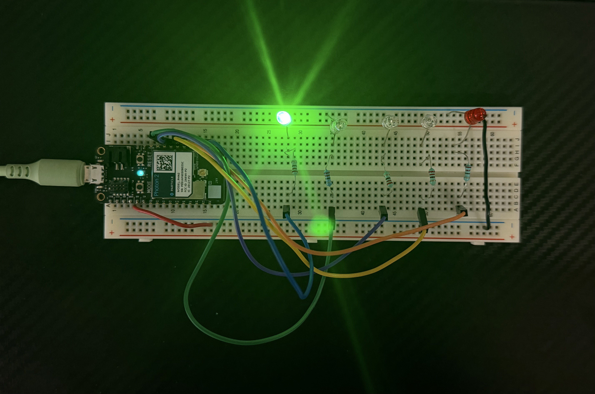
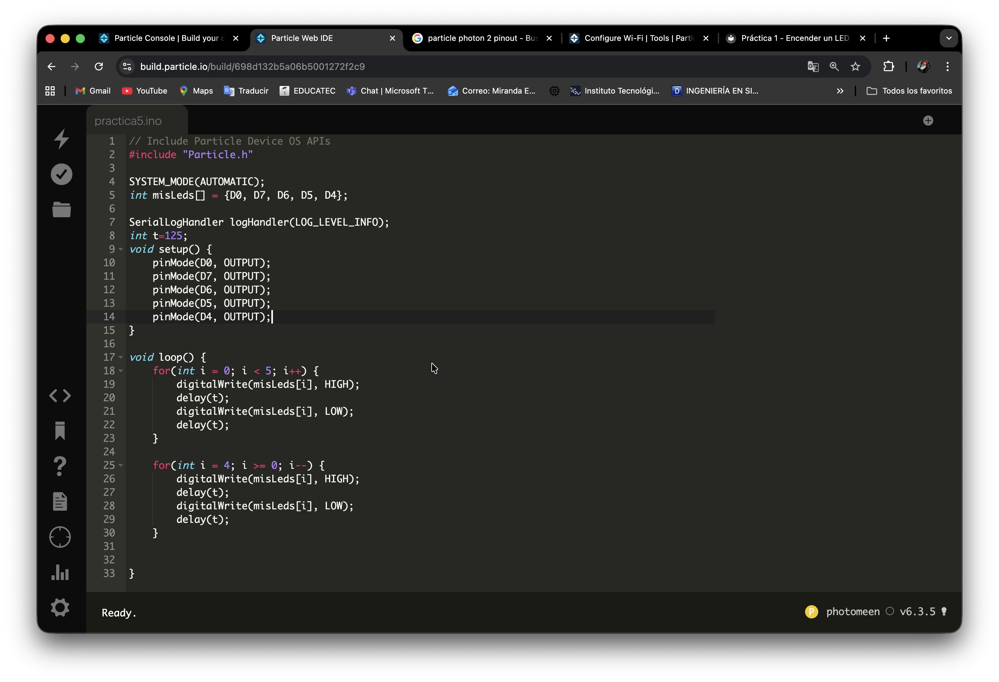

# Práctica 5 - Encender y apagar 5 LED's con cilos FOR

**Nivel:** Fácil  
**Duración:** 15 minutos

## Objetivo
Programar el Particle Photon 2 para controlar 5 LEDs utilizando un arreglo y ciclos for, generando un efecto de encendido secuencial de ida y vuelta, optimizando el código y aplicando estructuras repetitivas.

## Material
- 1 × Particle Photon 2
- 1 x Proto Board
- 5 × LED (cualquier color)
- 5 × Resistencia 220Ω
- Cables jumper
- Conexión a Internet

## Conexión

**LED → Pin D0**

**LED → Pin D7**

**LED → Pin D6**

**LED → Pin D5**

**LED → Pin D4**

| Componente     | Pin Photon2   |
|----------------|---------------|
| LED (ánodo)    | D0            |
| LED (cátodo)   | GND           |
| Resistencia    | Entre LED y D0|
| LED (ánodo)    | D7            |
| LED (cátodo)   | GND           |
| Resistencia    | Entre LED y D7|
| LED (ánodo)    | D6            |
| LED (cátodo)   | GND           |
| Resistencia    | Entre LED y D6|
| LED (ánodo)    | D5            |
| LED (cátodo)   | GND           |
| Resistencia    | Entre LED y D5|
| LED (ánodo)    | D4            |
| LED (cátodo)   | GND           |
| Resistencia    | Entre LED y D4|

## Ver Simulación

  <h3 style="color: #00f7ff; margin-bottom: 15px;">🔬 Simulación Interactiva – Particle Photon 2</h3>
  
  

    

    <!-- LED 1 (D10) - arriba izquierda -->
    

    
    <!-- LED 2 (D7) - abajo -->
    

    
    <!-- LED 3 (D6) - arriba -->
    

    
    <!-- LED 4 (D5) - abajo -->
    

    
    <!-- LED 5 (D4) - arriba derecha (más a la derecha) -->
    

  

  

    <button onclick="toggleKnightRider()" 
            id="btnSim"
            style="padding: 14px 40px; font-size: 18px; font-weight: bold; background: #00f7ff; color: #0f172a; border: none; border-radius: 50px; cursor: pointer; box-shadow: 0 0 20px #00f7ff;">
      ▶️ Iniciar Simulación
    </button>
  

  

    Efecto Knight Rider (ida y regreso)
  

## Código

**include "Particle.h"**

**SYSTEM_MODE(AUTOMATIC);**
# int misLeds[] = {
    D0, D7, D6, D5, D4
    };

**SerialLogHandler logHandler(LOG_LEVEL_INFO);**
int t=125;

# void setup() {
    pinMode(D0, OUTPUT);
    pinMode(D7, OUTPUT);
    pinMode(D6, OUTPUT);
    pinMode(D5, OUTPUT);
    pinMode(D4, OUTPUT);
}

# void loop() {
    for(int i = 0; i < 5; i++) {
        digitalWrite(misLeds[i], HIGH);
        delay(t);
        digitalWrite(misLeds[i], LOW);
        delay(t);
    }
    
    for(int i = 4; i >= 0; i--) {
        digitalWrite(misLeds[i], HIGH);
        delay(t);
        digitalWrite(misLeds[i], LOW);
        delay(t);
    }
    
}

## Procedimiento
1. Colocar el Particle Photon 2 a un extremo del protoboard
2. Colocar los 5 LED's en cualqueira de las lineas de conexión que estén libres
3. Conectar el catodo de los 5 led's a la linea de tierra del protoboard. NOTA: puede ser directo o con un jumper
4. Colocar una resistencia de 220Ω frente al otro extremo de los 5 LED's (ánodos) NOTA: no importa la direccion de la resistencia, asegurate de que la resistencia este en la lina que tiene continuidad con el LED
5. Conectar el extremo de las resistencias que quedaron libres un cable JUMPER para llevarlo a los pines elegidos (D10, D7, D6, D5, D4)
6. Conectar con un cable de tipo MICRO-USB el Particle Photon 2 a tu PC 
7. Conectar el Particle Photon 2 a Internet, puedes usar este enlace: (https://docs.particle.io/tools/developer-tools/configure-wi-fi/)

## Resultado Esperado
Se espera que los cinco LEDs se enciendan uno tras otro desde el primer pin hasta el último y posteriormente regresen en orden inverso, generando un efecto de desplazamiento continuo.

## Evidencia

## Ver Video
<video width="50%" controls>
  <source src="/manual-iot/assets/videos/practica5.mp4" type="video/mp4">
  Tu navegador no soporta video.
</video>