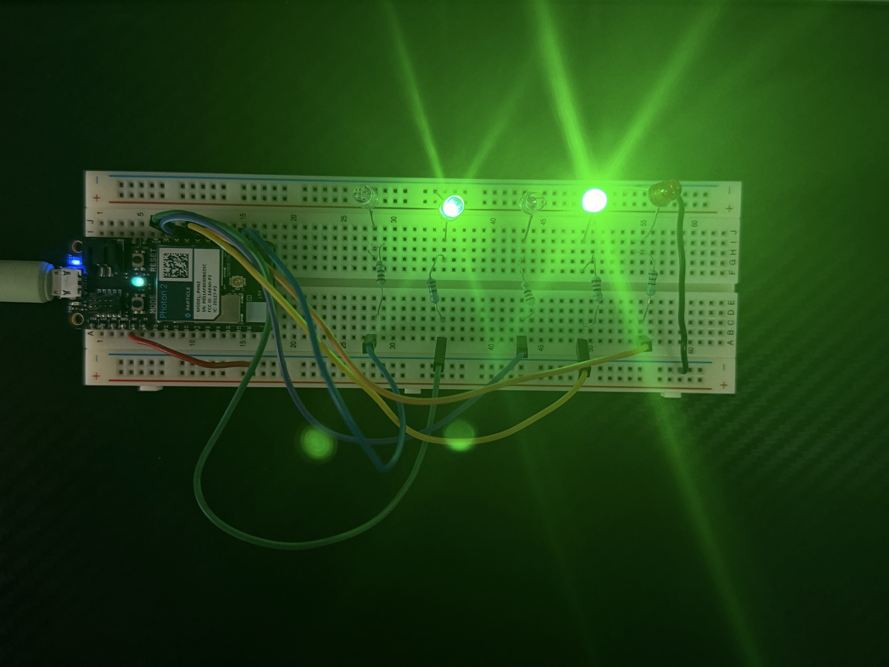
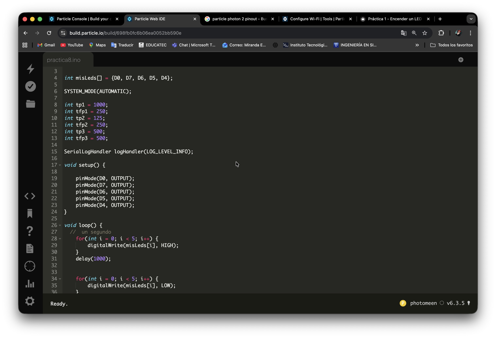

# Práctica 8 - Combinación de patrones de iluminación con diferentes tiempos en 5 LEDs

**Nivel:** Fácil  
**Duración:** 15 minutos

## Objetivo
Programar el Particle Photon 2 para generar múltiples patrones de iluminación combinados en cinco LEDs, utilizando ciclos for, arreglos y distintos tiempos de retardo, con el fin de aplicar secuencias variadas y control avanzado de salidas digitales.

## Material
- 1 × Particle Photon 2
- 1 x Proto Board
- 5 × LED (cualquier color)
- 5 × Resistencia 220Ω
- Cables jumper
- Conexión a Internet

## Conexión

**LED → Pin D0**

**LED → Pin D7**

**LED → Pin D6**

**LED → Pin D5**

**LED → Pin D4**

| Componente     | Pin Photon2   |
|----------------|---------------|
| LED (ánodo)    | D0            |
| LED (cátodo)   | GND           |
| Resistencia    | Entre LED y D0|
| LED (ánodo)    | D7            |
| LED (cátodo)   | GND           |
| Resistencia    | Entre LED y D7|
| LED (ánodo)    | D6            |
| LED (cátodo)   | GND           |
| Resistencia    | Entre LED y D6|
| LED (ánodo)    | D5            |
| LED (cátodo)   | GND           |
| Resistencia    | Entre LED y D5|
| LED (ánodo)    | D4            |
| LED (cátodo)   | GND           |
| Resistencia    | Entre LED y D4|

## Ver Simulación

  <h3 style="color: #00f7ff; margin-bottom: 15px;">🔬 Simulación Interactiva – Particle Photon 2</h3>
  
  

    

    <!-- LED 1 (D0) -->
    

    
    <!-- LED 2 (D7) -->
    

    
    <!-- LED 3 (D6) -->
    

    
    <!-- LED 4 (D5) -->
    

    
    <!-- LED 5 (D4) -->
    

  

  

    <button onclick="toggleSimulation8()" 
            id="btnSim"
            style="padding: 14px 40px; font-size: 18px; font-weight: bold; background: #00f7ff; color: #0f172a; border: none; border-radius: 50px; cursor: pointer; box-shadow: 0 0 20px #00f7ff;">
      ▶️ Iniciar Simulación
    </button>
  

  

    Secuencia 1 → 2 → 3 → 4 (se repite)
  

## Código

**include "Particle.h"**

**SYSTEM_MODE(AUTOMATIC);**
# int misLeds[] = {
    D0, D7, D6, D5, D4
    };

**SerialLogHandler logHandler(LOG_LEVEL_INFO);**

int tp1 = 1000;
int tfp1 = 250;
int tp2 = 125;
int tfp2 = 250;
int tp3 = 500;
int tfp3 = 500;

# void setup() {
    pinMode(D0, OUTPUT);
    pinMode(D7, OUTPUT);
    pinMode(D6, OUTPUT);
    pinMode(D5, OUTPUT);
    pinMode(D4, OUTPUT);
}

# void loop() {
    //  un segundo
    for(int i = 0; i < 5; i++) {
        digitalWrite(misLeds[i], HIGH);
    }
    delay(1000); 
    
    
    for(int i = 0; i < 5; i++) {
        digitalWrite(misLeds[i], LOW);
    }
    delay(1000); 
    

    digitalWrite(D0, HIGH);
    digitalWrite(D6, HIGH);
    delay(tp3);
    digitalWrite(D0, LOW);
    digitalWrite(D6, LOW);
    delay(tp3);
    
    digitalWrite(D7, HIGH);
    digitalWrite(D5, HIGH);
    delay(tfp2);
    digitalWrite(D7, LOW);
    digitalWrite(D5, LOW);
    delay(tfp2);
    
    for(int i = 0; i < 5; i++) {
        digitalWrite(misLeds[i], HIGH);
        delay(tp2);
        digitalWrite(misLeds[i], LOW);
        delay(tp2);
    }

    for(int i = 4; i >= 0; i--) {
        digitalWrite(misLeds[i], HIGH);
        delay(tp2);
        digitalWrite(misLeds[i], LOW);
        delay(tp2);
    }
    
    for(int i = 4; i >= 0; i--) {
        digitalWrite(misLeds[i], HIGH);
        delay(tp2);
        digitalWrite(misLeds[i], LOW);
        delay(tp2);
    }
    
    for(int i = 0; i < 5; i++) {
        digitalWrite(misLeds[i], HIGH);
        delay(tp2);
        digitalWrite(misLeds[i], LOW);
        delay(tp2);
    }
}

## Procedimiento
1. Colocar el Particle Photon 2 a un extremo del protoboard
2. Colocar los 5 LED's en cualqueira de las lineas de conexión que estén libres
3. Conectar el catodo de los 5 led's a la linea de tierra del protoboard. NOTA: puede ser directo o con un jumper
4. Colocar una resistencia de 220Ω frente al otro extremo de los 5 LED's (ánodos) NOTA: no importa la direccion de la resistencia, asegurate de que la resistencia este en la lina que tiene continuidad con el LED
5. Conectar el extremo de las resistencias que quedaron libres un cable JUMPER para llevarlo a los pines elegidos (D10, D7, D6, D5, D4)
6. Conectar con un cable de tipo MICRO-USB el Particle Photon 2 a tu PC 
7. Conectar el Particle Photon 2 a Internet, puedes usar este enlace: (https://docs.particle.io/tools/developer-tools/configure-wi-fi/)

## Resultado Esperado
Se espera que el sistema ejecute varios efectos de iluminación de manera continua:
-	Primero, todos los LEDs se encienden y apagan al mismo tiempo.
-	Después, se encienden en combinaciones por pares.
-	Luego, se generan secuencias rápidas en ambos sentidos.

## Evidencia

## Ver Video
<video width="50%" controls>
  <source src="/manual-iot/assets/videos/practica8.mp4" type="video/mp4">
  Tu navegador no soporta video.
</video>