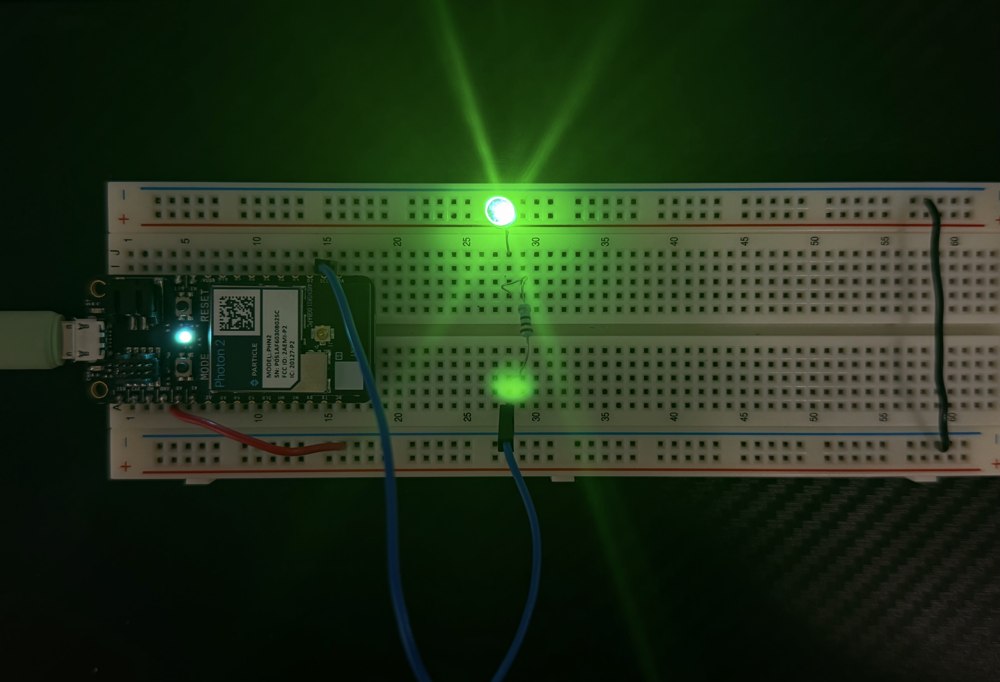
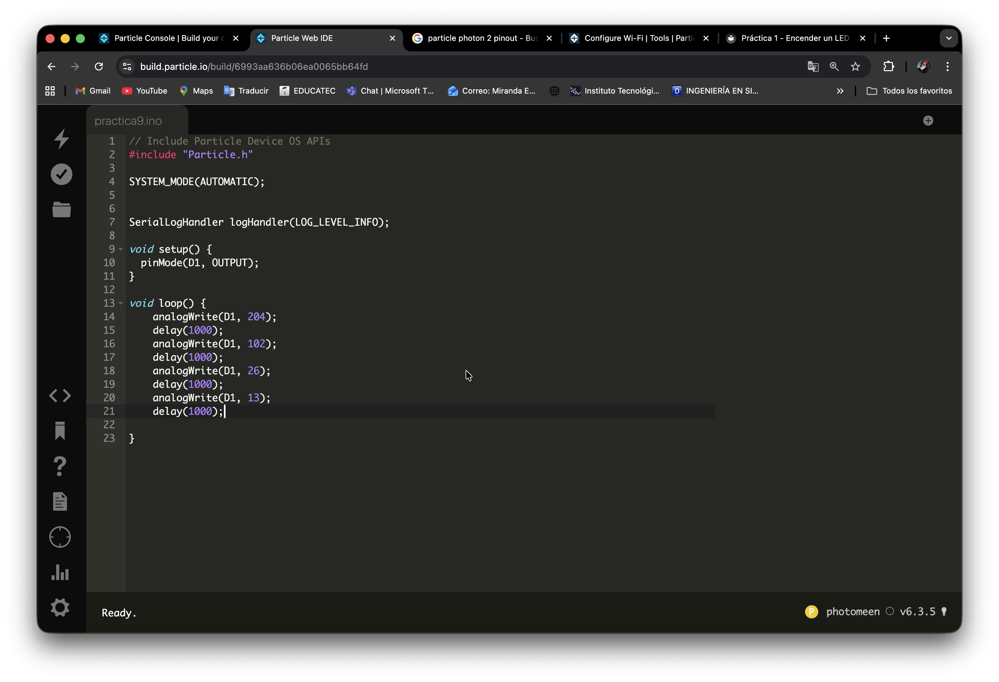

# Práctica 9 - Control de brillo de un LED mediante señal PWM

**Nivel:** Fácil  
**Duración:** 15 minutos

## Objetivo
Para variar progresivamente la intensidad luminosa de un LED utilizando la función analogWrite(). NOTA: asegurate de que el pin elegido tenga soporte para PWM

## Material
- 1 × Particle Photon 2
- 1 x Proto Board
- 1 × LED (cualquier color)
- 1 × Resistencia 220Ω
- Cables jumper
- Conexión a Internet

## Conexión

**LED → Pin D1**

| Componente     | Pin Photon2   |
|----------------|---------------|
| LED (ánodo)    | D1            |
| LED (cátodo)   | GND           |
| Resistencia    | Entre LED y D1|

## Ver Simulación

  <h3 style="color: #00f7ff; margin-bottom: 15px;">🔬 Simulación Interactiva – PWM en LED (D1)</h3>
  
  

    

    <!-- LED con PWM (brillo variable) -->
    

    

  

  

    <button onclick="togglePWM()" 
            id="btnSim"
            style="padding: 14px 40px; font-size: 18px; font-weight: bold; background: #00f7ff; color: #0f172a; border: none; border-radius: 50px; cursor: pointer; box-shadow: 0 0 20px #00f7ff;">
      ▶️ Iniciar Simulación PWM
    </button>
  

  

    Brillo: 204 → 102 → 26 → 13 (se repite cada segundo)
  

## Código

**include "Particle.h"**

**SYSTEM_MODE(AUTOMATIC);**

**SerialLogHandler logHandler(LOG_LEVEL_INFO);**

# void setup() {
    pinMode(D1, OUTPUT);

}

# void loop() {
    analogWrite(D1, 204);
    delay(1000);
    analogWrite(D1, 102);
    delay(1000);
    analogWrite(D1, 26);
    delay(1000);
    analogWrite(D1, 13);
    delay(1000);
}

## Procedimiento
1. Colocar el Particle Photon 2 a un extremo del protoboard
2. Colocar el LED en cualquiera de las lineas de conexión que estén libres
3. Conectar el catodo del led a la linea de tierra del protoboard. NOTA: puede ser directo o con un jumper
4. Colocar una resistencia de 220Ω frente al otro extremo del LED (ánodos) NOTA: no importa la direccion de la resistencia, asegurate de que la resistencia este en la lina que tiene continuidad con el LED
5. Conectar el extremo de la resistencia que quedo libre un cable JUMPER para llevarlo a el PIN elegido (D1)
6. Conectar con un cable de tipo MICRO-USB el Particle Photon 2 a tu PC 
7. Conectar el Particle Photon 2 a Internet, puedes usar este enlace: (https://docs.particle.io/tools/developer-tools/configure-wi-fi/)

## Resultado Esperado
Se espera que el LED aumente su intensidad de manera gradual hasta alcanzar el máximo brillo y posteriormente disminuya progresivamente hasta apagarse por completo.

## Evidencia

## Ver Video
<video width="50%" controls>
    <source src="/manual-iot/assets/videos/practica9.mp4" type="video/mp4">
    Tu navegador no soporta video.
</video>